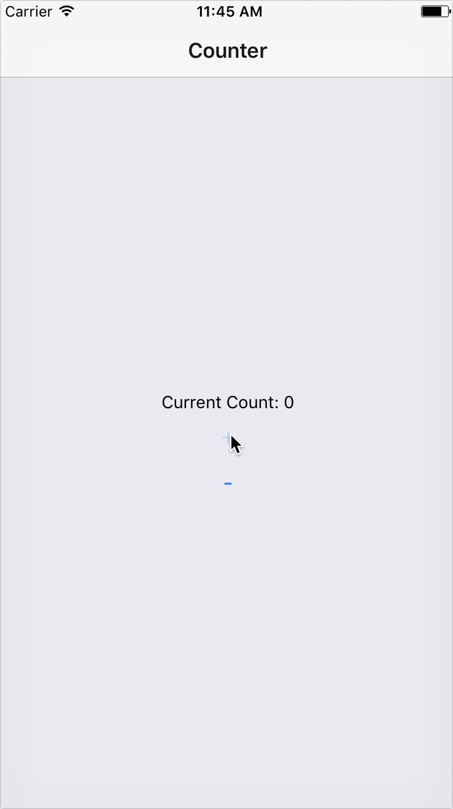

<h1 align="center">skits</h1>
<div align="center">
  <strong>Tiny helper for connecting MobX and React/React Native</strong>
</div>
<br>
<div align="center">
  <a href="https://npmjs.org/package/skits">
    
  </a>
  <a href="https://npmjs.org/package/skits">
  
  </a>
  <a href="https://github.com/feross/standard">
    
  </a>
  <a href="https://github.com/prettier/prettier">
    
  </a>
  <a href="https://travis-ci.org/tiaanduplessis/skits">
    
  </a>
  <a href="https://github.com/tiaanduplessis/skits/blob/master/LICENSE">
    
  </a>
  <a href="http://makeapullrequest.com">
    
  </a>
</div>
<br>
<div align="center">
  <a href="https://github.com/tiaanduplessis/skits/watchers">
    
  </a>
  <a href="https://github.com/tiaanduplessis/skits/stargazers">
    
  </a>
  <a href="https://twitter.com/intent/tweet?text=Check%20out%20skits!%20https://github.com/tiaanduplessis/skits%20%F0%9F%91%8D">
    
  </a>
</div>
<br>
<div align="center">
  Built with ❤︎ by <a href="https://github.com/tiaanduplessis">tiaanduplessis</a> and <a href="https://github.com/tiaanduplessis/skits/contributors">contributors</a>
</div>

<h2>Table of Contents</h2>
<details>
  <summary>Table of Contents</summary>
  <li><a href="#install">Install</a></li>
  <li><a href="#usage">Usage</a></li>
  <li><a href="#acknowledgements">Acknowledgements</a></li>
  <li><a href="#contribute">Contribute</a></li>
  <li><a href="#license">License</a></li>
</details>

## Install

```sh
$ npm install skits
# OR
$ yarn add skits
```

## Usage

```jsx
import Skits, { inject } from 'skits'
import {Router, Scene} from 'react-native-router-flux'
import React from 'react'
import { View, Button, Text, AppRegistry } from 'react-native'

const skits = new Skits()

skits.store({
  name: 'counter',
  state: {
    count: 0
  },
  actions: {
    increase() {
      ++this.count
    },
    decrease() {
      --this.count
    }
  },
  computed: {
    description() {
      return `Current Count: ${this.count}`
    }
  }
})

const Counter = inject(({ stores }) =>
  <View style={{ flex: 1, justifyContent: 'center', alignItems: 'center' }}>
    <Text>
      {stores.counter.description}
    </Text>
    <Button title="+" onPress={stores.counter.increase} />
    <Button title="-" onPress={stores.counter.decrease} />
  </View>
)

skits.router(() =>
  <Router>
    <Scene key="root">
      <Scene key="counter" component={Counter} title="Counter" />
    </Scene>
  </Router>
)

AppRegistry.registerComponent('skitsExample', () => skits.App);

```

<div align="center">
  
</div>

## Acknowledgements

This module is inspired/based on [cans](https://github.com/djyde/cans). 

## Contributing

Contributions are welcome!

1. Fork it.
2. Create your feature branch: `git checkout -b my-new-feature`
3. Commit your changes: `git commit -am 'Add some feature'`
4. Push to the branch: `git push origin my-new-feature`
5. Submit a pull request :D

Or open up [a issue](https://github.com/tiaanduplessis/skits/issues).

## License

Licensed under the MIT License.
